# Create Digital Ocean Webserver

## Learning Objectives

1. Create a web server with Digital Ocean
2. Configure the Apache 2 web server to serve your content "on the internet"
3. Configure the web server to serve from your own `public_html` directory
4. Use `rsync` to upload web pages to your new host

## Recipe

In order to easily flow through this lesson, it might be advisable to get the
following items ready:

* Notepad / writing implement
* 2 **strong passwords**
* Credit Card (in order to pay for Digital Ocean hosting $5.00/month)

## Introduction

In the old days, understanding web technology was easier because, well there
was much less of it. To understand what was going "out there in the web" was
easier because we didn't have JavaScript, we didn't have large-scale web
hosts, we didn't have Medium or Squarespace. What we _did_ have were browsers
and a simple program written in C called "Apache" which knew how to take web
pages and make them available via HTTP.

If you're not sure about what "HTML" or "HTTP" are, trust us, you're going to
be getting _very_ familiar with those terms. Come back and re-read this later!

To earn our first merit badge as web developers we want to deploy a "real-deal"
web server "on the internet" so we can show our parents, significant others,
dogs, and the David Foster Wallace fan club our awesome skills.

## Step 1: Acquire a Web Server

When we're developing for this course, we'll be working in a "local"
environment. When we're ready to share our project with the world, we'll want
to put our code in a "production" environment i.e. "on the internet." Your
"local" environment can be the Flatiron School's Learn in-browser IDE, or your
own laptop. The "production" environment will be a server that you set up.

In this course we're going to use Digital Ocean (aka "DO") to set up a web
server that will be our production environment. This will require a credit card
and following DO's signup process. Granted, there are many _other_ providers
besides DO, (linode, AWS, etc.) but we've found their setup process to be
simple, so we're going with that one.

We're going to walk you through this process. There are **9** steps. That's a
lot of steps, but they're all focused and simple if you focus on one step at a
time. It turns out that that's one of the most important attitudes you can
have about programming: the final product is _soooo big_ &mdash; just focus on
doing the step at hand and you'll get there.

In "Bird by Bird" Anne Lamott wrote:

> “E.L. Doctorow said once said that 'Writing a novel is like driving a car at
> night. You can see only as far as your headlights, but you can make the whole
> trip that way.' You don't have to see where you're going, you don't have to
> see your destination or everything you will pass along the way. You just have
> to see two or three feet ahead of you. This is right up there with the best
> advice on writing, or life, I have ever heard.”

### Step 1A: Create an Account

Just like dozens of _other_ services you've signed up for, create an account at
DO:

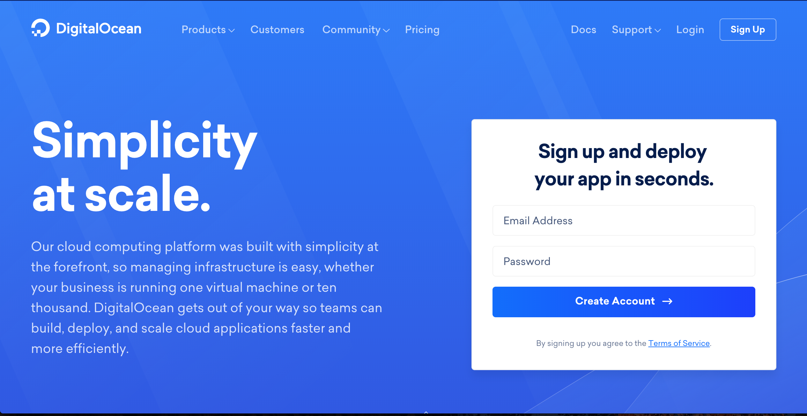

### Step 1B: Verify Your Account via Email

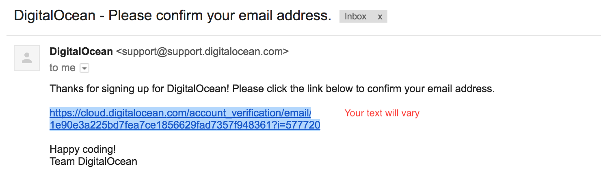

### Step 1C: Provide Payment Details

Alas, this is the part where you have to give up some payment details!

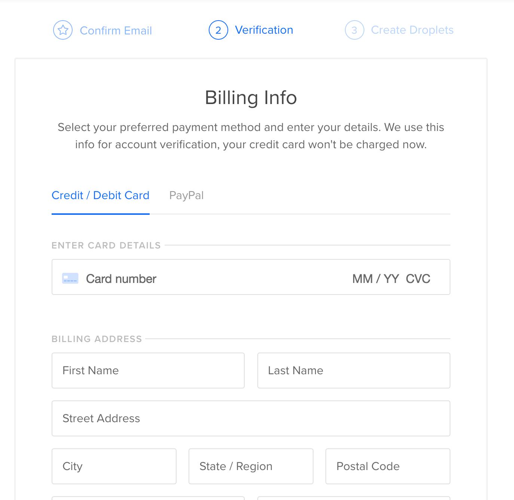

### Step 1D: Redirected to a Prompt to Create a Droplet

We're ready to create a droplet!

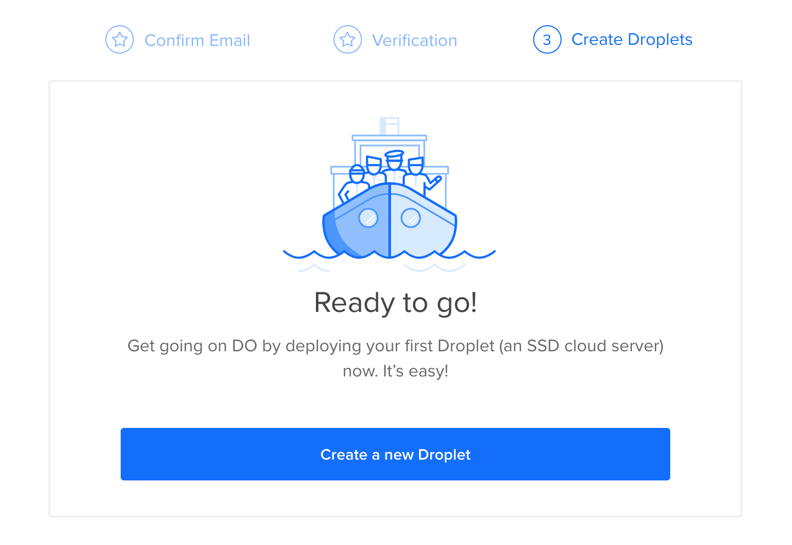

### Step 1E: Create the Droplet

**We're going to accept the defaults for most every field**.

Here are a few lines to check / things to change:

Select:

* **Operating System**: Ubuntu (It's a type of Linux, a very popular operating system for servers). It should be the default. Other Linux types are good, but tend to be specialized. Ubuntu has tons of support docs, internet forum documentation, and DO help pages.
* Cheapest size possible: 1GB
* Choose a data center region: Choose the closest data center
* Choose a hostname: We think _firstname-lastname-prod_ is a good idea here.

**Pro-tip**: Try not to name your host anything too embarrassing, we've seen
developers get surprised when their site goes down and the server reports
"i-love-mr-schnookums-my-poodle" has an error. You _can_ accept the default but
it's usually rather machine-y and hard to remember

### Step 1F: Wait

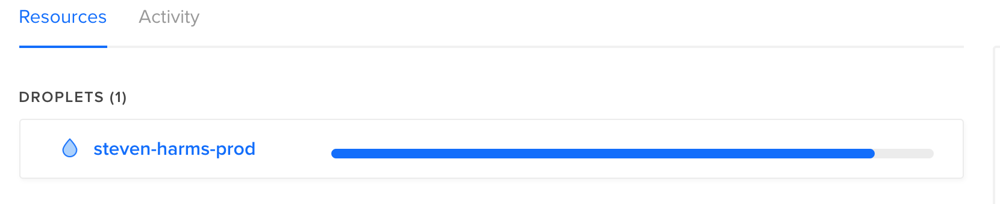

Digital Ocean will now make a server for you. The fancy tech word for this is
_"Provision"_ &mdash; fancy! You can imagine elves at DO building you a new
server. They put chips in it, memory, disk storage, they wire up the networking
connection and they power it up. They then put the Ubuntu operating system on
it and then tell it that it's name is the hostname you provided. They then send
you an email.

_The Truth Is_...there aren't elves (sorry!) and DO isn't _really_ building you
a server.  They're creating a _virtual_ server. That is, they're telling a whole
_cloud_ of server to pretend as if there's a _real_ host with the hostname you
described.  But, for simplicity's sake, you might like to imagine it as a real
server being created here though.

### Step 1G: Check Your Email

When the server has been "provisioned," DO will send you an email confirming
that the host has been created. Inside this email you'll be given:

* **IP Address**: make a note of it
* **Username**: root
* **Password**: something difficult to remember that you'll want to copy-and-paste

Below we're going to refer to the values that are provided in this email as
`YOUR_IP_ADDRESS_FROM_1G`. We're referring to the information sent in the email
so don't type in "Y-O-U-R...(and so on)" enter the value provided here. Just
like the phrase "Hit Any Key" &mdash; hit any key, don't search for a key
labeled "Any" :)

### Step 1H: Log Into the Server As `root`

The `root` account is very special it can **do anything** on your machine.
Consequently, you don't want to log in as it very often. If you delete a whole
directory, in the wrong directory, as `root`, you could literally delete the
operating system (whups!). To help us protect ourselves from ourselves, we want
to create an "un-privileged" (i.e. not `root`!) account. Nevertheless we need
to log in once, carefully, as `root` to make that account.

From your LearnIDE Terminal type:

`ssh root@YOUR_IP_ADDRESS_FROM_1G`

Accept the warning, it's OK. It's asking: "You never went here before, are you
sure this is where you mean to go?"

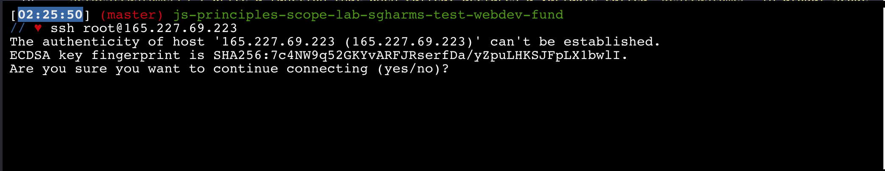

Provide the password given in the email in step 1G.

You will be immediately prompted to change the password. First, provide the
password given in your email ("the current password"), then provide a **strong
password** for your `root` account. This machine is **on the internet** which
is a not-entirely-safe place. DO advises in their email:

> For security reasons, you will be required to change this Droplet’s root
> password when you login. You should choose a strong password that will be
> easy for you to remember, but hard for a computer to guess. You might try
> creating an alpha-numerical phrase from a memorable sentence (e.g. “I won my
> first spelling bee at age 7,” might become “Iwm#1sbaa7”). Random strings of
> common words, such as “Mousetrap Sandwich Hospital Anecdote,” tend to work
> well, too.

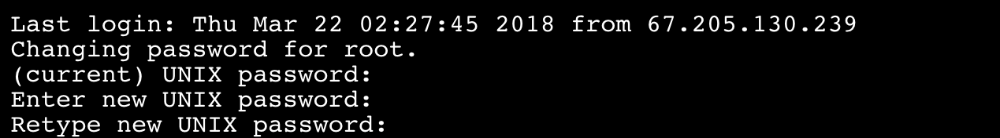

Now, determine an "unprivileged" account name. It's usually something less than or
equal to 8 characters long. `flastname` or `byronpoodle` or `poodlluvr` are all
typical usernames.

From here you can follow Digital Ocean's [Guide][] Steps 1-3. In the Guide they
create an account called `demo`. Instead, use your unprivileged account name.

Make sure you write it down. You don't want to forget this. You'll also need to
provide **another, different, strong** password for this account. You'll be
prompted for other fields like "Room Number" or "Full Name." Fill in the fields
you want and hit "Enter" to accept the empty defaults for things that don't
apply.

Come back here when you're done, but the process should look something like
this:

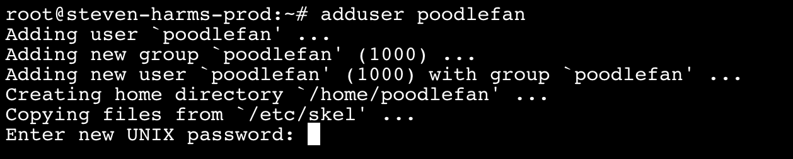

### Step 1I: Log In As An Unprivileged User

At this point, you're still logged into your droplet as `root`. Type `exit` to
disconnect.

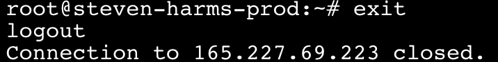

Now, let's _re-connect_ with our new user.

From your LearnIDE Terminal type:

`ssh YOUR_UNPRIVILEGED_USERNAME@YOUR_IP_ADDRESS_FROM_1G`

and provide the password you created in Step 1H.

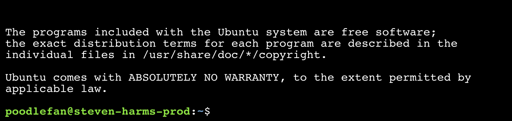

Now you're logged into the remote host! Great job!

**WHOA**: Believe it or not you've just done the **primary** activity of
"Systems Administrators" or "DevOps Engineers." Their careers are built around
maintaining and providing the server horsepower needed to make businesses run!
This is a big deal. We recommend a happy dance.

We now want to install a web server.

### Step 2: Install Apache

As a reminder, we are now logged in as the unprivileged user `poodlefan`.

We'll be following along with DO's [Apache2 Installation Guide][a2ig], so it
might help to read it over after we finish our work here so as to understand
what you just did.

To install Apache we do the following commands. We denote "something you need
to type into the terminal" by beginning the command with `$`. You'll also see
commands are begun with `sudo` which means: run this _as if_ I were `root`. By
restricting `root` like behaviors on a per-command basis, we decrease the
chances of us doing something Very Bad.

**NOTE**: When we run a command with `sudo`, we'll be prompted for a
password once that's valid for 5 minutes from the _last_ sudo use. It's a bit
like logging into some websites: you and provide a password and it's valid for
a certain number of weeks or months, but then every now-and-again, you're
prompted for it again.  Short version: if you're asked for a password by sudo,
give you login password.

Type:

1. `$ sudo apt-get update`
2. Watch the Ubuntu operating system "update" its list of sources for
   downloading cool applications.
3. It looks like this: [apt-get update running](./img/DO_12_apt-get-update.png)
4. `$ sudo apt-get install apache2`
5. Get prompted to accept the download pack by hitting enter or `y`
6. It looks like this: [apt-get install running](./img/DO_13_apt-get-install.png)
7. Upon completion it looks like this: [apt-get install running](./img/DO_14_apt-get-end.png)

Last, visit the IP address you got in Step 1G, above in a web browser.

`http://IP_ADDRESS_FROM_STEP_1G`

You should get an Apache Test page if everything is working properly.

Congratulations!  You installed the Apache web server! We're going to make one
last tweak.

## Step 3: Configure the web server to serve from your own `public_html` directory

In this step we're going to make our server easy to use for the rest of the
class. Web site server configuration and options is a **whole class unto
itself** but we're going to do something very simple here. We're going to make
things so that Apache "serves" pages located in your unprivileged user's
directory `public_html` at:

`http://IP_ADDRESS_FROM_STEP_1G/~UNPRIVILEGED_USER_NAME`

1. Tell Apache to serve unprivileged users' `public_html` directories
  * `$ sudo ln -s /etc/apache2/mods-available/userdir.conf /etc/apache2/mods-enabled/userdir.conf`
  * `$ sudo ln -s /etc/apache2/mods-available/userdir.load /etc/apache2/mods-enabled/userdir.load`
  * `sudo /etc/init.d/apache2 restart`
2. Configure the unprivileged account's `public_html` directory
  * `$ cd`
  * `$ mkdir $HOME/public_html`
  * `$ echo "Hello, World from my web sever!" > $HOME/public_html/index.html`
3. Visit the IP address from step 1G with `/~username` at the end. For example:
   `http://165.227.69.223/~poodlefan/`
4. HOLY MOLY! You're serving a web page from your own server!

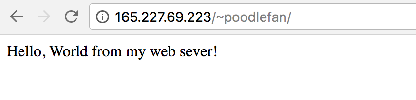

You can change the message in the `echo` command above to be something more
personal: `echo "Byron the poodle is the best" > $HOME/public_html/index.html`.
Do whatever it takes to make you convinced that you server is working with the
data **you** put up there!

Type `exit` to log out of your remote server and return to your local
environment.

## Step 4: Synchronization

In Step 1 we talked about "local" and "production" environment. We're going to
work in a "local" environment until we're happy and then we're going to put our
"local" product on the "production" environment. For much of the class, it's
reasonable to work in the local environment only. However, as you learn things
that you want to show off or add to a portfolio, you're going to want to put
your creations on your droplet, your "production" environment.

There are many options for doing this synchronization, but they are all built
on top of this **most basic** flow: use a program called `sftp` (**S**ecure
**F**ile **T**ransfer **P**rotocol) or its cousin `scp` (**S**ecurely
**C**o**p**y) to make a copy from my local environment to my remote
environment.

In this lesson, you are given a `demo.html` file. We're going to copy that file
to your production environment, your new droplet, and save it on top of the
existing `index.html` file.

`$ scp demo.html unprivileged-account@you-server-ip:public_html/index.html`

Reload `http://YOUR_IP_ADDRESS_FROM_1G/~poodlefan/`

HOLY MOLY - You just synchronized a local file to a remote server, your server
by hand!

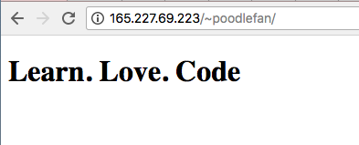

Feel free to change the text of `demo.html` (i.e. making a "local" change) and
then use `scp` to put it on the remote server. Exploration is healthy when
learning this stuff!

## Synchronizing Directories and All Their Subdirectories

As we build more complex sites, we might want to synchronize whole directories
and their subdirectories (a fancy term for this is "recursively") instead of
one-file-at-a-time. For this we can use a tool called `rsync` that "rides on
top of" the SFTP/SCP layer. `rsync` will do some housekeeping for you before
basically doing what we just did by hand.

In this lesson we've provided a slightly more complex site in the
`complex_site` directory. Here's how we "synchronize" it to our remote,
production-environment directory:

`rsync -azP ./complex_site/* unprivileged-account@YOUR_IP_ADDRESS_FROM_1G:public_html`

This means "rsync" (you can ignore the `-azP` flag, they're details at this
point) send all (`*`) the contents of `complex_site` over to my server and put
them in `public_html`.

If you sync `complex_site` to your server and refresh your browser page you
should now see:

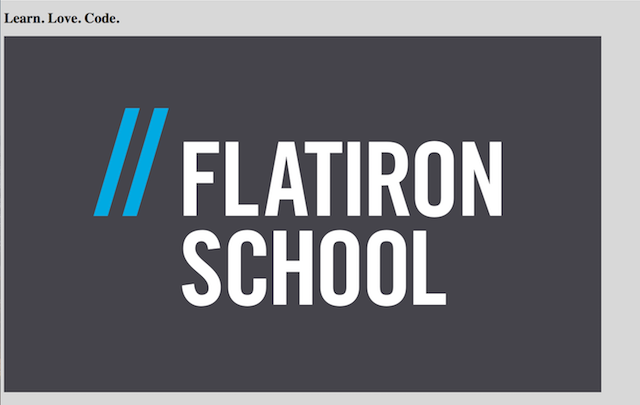

While we're going to start with simple and single HTML files, this command will
rapidly become your favorite as it keep track of changes and updates the fewest
files possible, as quickly as possible.

## A Word About Security

You're creating a server. You're putting it on the Internet. Bots. Spammers.
Bitcoin miners. Opportunists. Your server is vulnerable to _all_ of these things.

To protect servers we go to great lengths, sometimes disabling password-based
login and preferring physical keys! You're not going to this extent on this
server, of course. Nevertheless, reasonable precautions should be taken.
Choose strong passwords. If you decide, after this class, that you don't need
this droplet _delete it_. Just like valuables on the sidewalk of a busy city,
if you're not minding the valuables, someone will assume your permission to
take them.

## Conclusion

Congratulations, this has been an _epic_ undertaking. You've launched a server,
created a user account, configured a web server, and moved your own content!

We'll keep tuning our workflow as our sites get more complicated, but this is a
huge moment! Congratulations!

[Guide]: https://www.digitalocean.com/community/tutorials/initial-server-setup-with-ubuntu-14-04
[a2ig]: https://www.digitalocean.com/community/tutorials/how-to-install-linux-apache-mysql-php-lamp-stack-on-ubuntu-14-04
